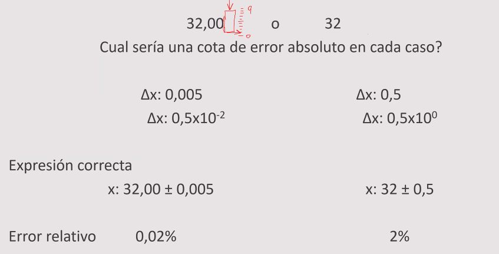
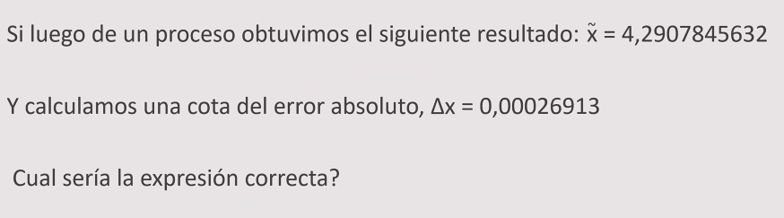

# Clase practica 11-3 

cual es la cota de error absolto en cada caso

32.00 o 32

siempre tengo que tener informacion sobre todos los digitos que me interesa

en 32.00

tengo que analizar la 3ra posicion, el error de este numero podria ser 0.00x ?
cual es el minimo valor que yo podria poner ahi
necesito que un valor sumado y restado me haga recorrer las 10 posiciones que pueden ir ahi
en este caso puede ser le 0.005 

forma normalizada: $0.5 \cdot 10^-t$
- con $t$ la cantidad de digitos significativos

---

como podriamos escribir esto de buen resultado

- Las cotas de errores
    1. determinar la cantidad de digitos
    2. las cotas las vamos a escribir como un solo digito significativo
 

##### Redondeo truncado
- Redondeo el primer digito significativo: $\Delta x = 0.0003 = 3\cdot10^{-3}$ 
Tengo que analizar en la muestra si el digito donde esta $t$ si esta parcialmente afectado de error o no

en este caso es el 4.2907
- el 7 se queda ya que mi cota es un valor menor a 5 (en este caso es 3 el valor de la cota) __tiene informacion parcialmente afectada por los errores__

##### Redondeo simetrico
- No me importa la cota, veo que la posicion $t$ de la muestra tiene un un numero a su derecha >= 5, entonces redondeo

--- 

- Si me quiero asegurar que sea cota: $\Delta x = 0.3$ (me tengo que ir arriba siempre)

> En el primer caso como es un 0.3 , el 18.3 esta afectado parcialmente
> pero en el caso de abajo el 18.3 esta afectado totalmente por el 0.9, al mismo tiempo, lo expreso como 18 +- 0.9, como el error total es afectado, saco el digito decimal

---
>hacer

---

---

### Propagacion de errores en operaciones elementales

> al derivar tomamos modulo para que haya una cota
> $f_a$ y $f_b$ son factores de amplificacion

#### Suma

###### Error relativo

---

#### Resta
>cuando tengo que restar dos numeros parecidos esto tiene efecto caotico

###### Error relativo

> si a-b son parecidos, los factores se van a infinitos, se van a hacer muy grandes
> __una resta puede generar un impacto muy grande en el resultado__
> se llama efecto cancelacion de terminos

---

#### Multiplicacion

###### Error relativo

---

#### Division

###### Error relativo
